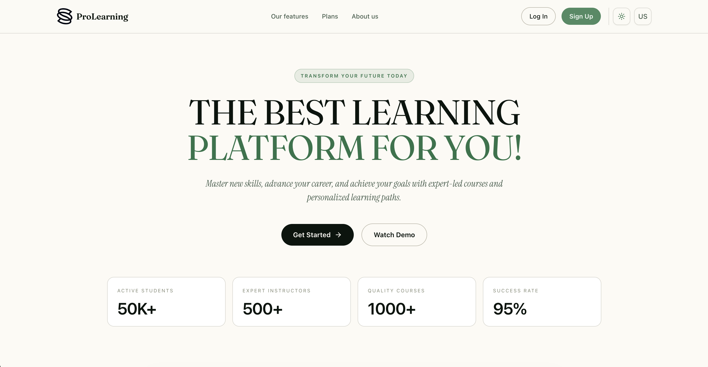
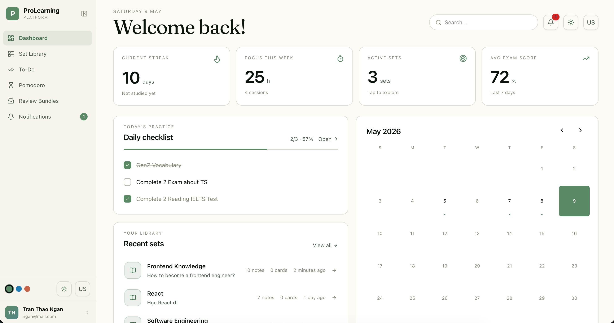
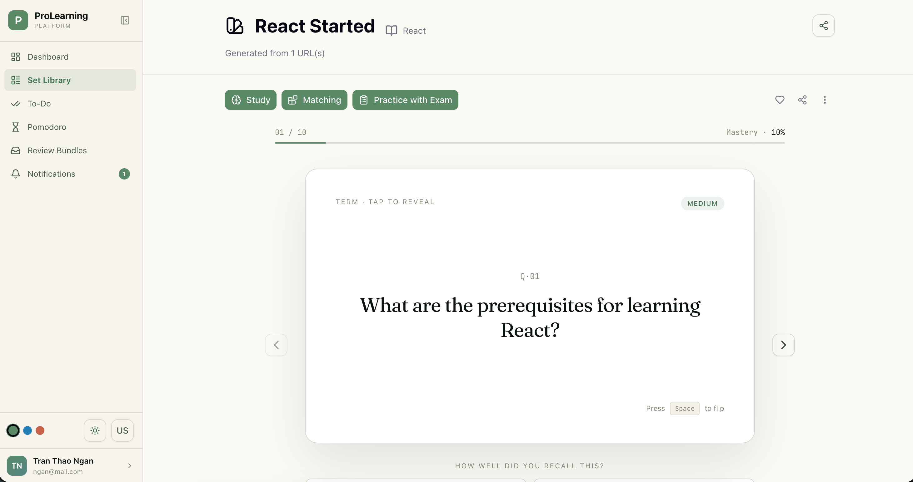
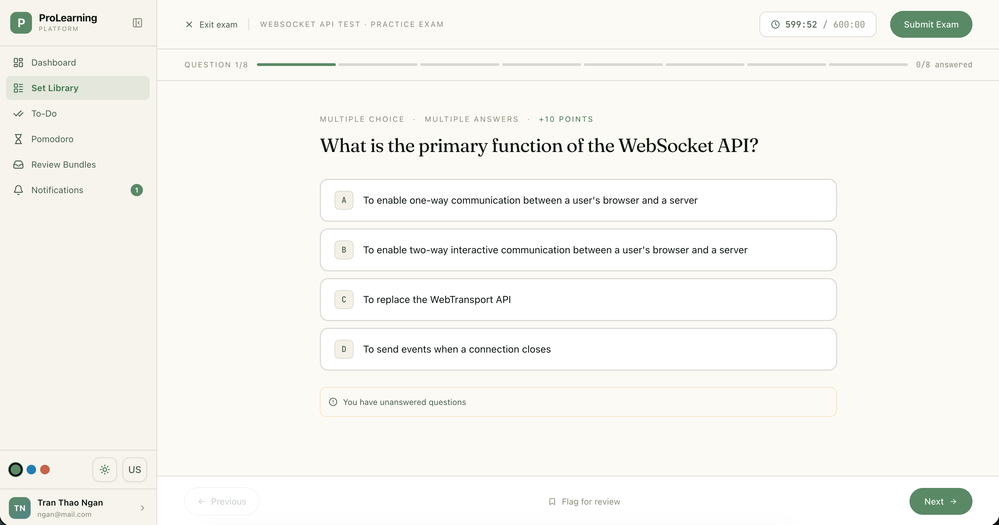
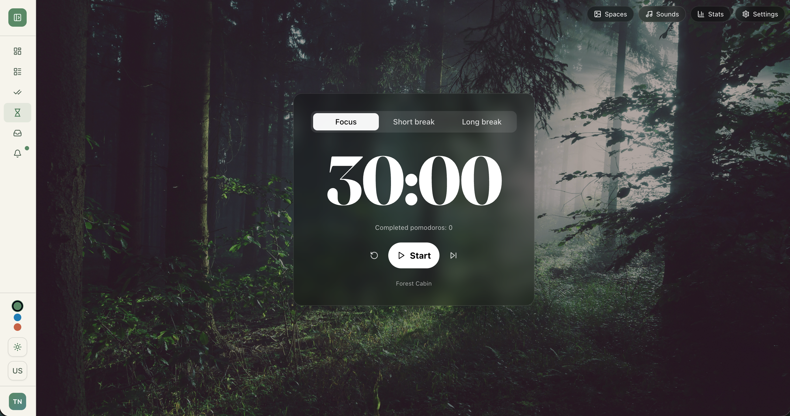

# ProLearning Platform — Frontend

A comprehensive online learning and study management platform built with React, TypeScript, and Vite.

## Screenshots

| Landing Page | Dashboard |
|---|---|
|  |  |

| Flashcard | Exam Progress |
|---|---|
|  |  |

| Pomodoro Timer |
|---|
|  |

## Features

- **Study Sets** — Create and organize notes, flashcards, and exams in one place
- **Flashcard Learning** — Spaced repetition system for effective memorization
- **Exam Engine** — Create, take, and review exams with AI-assisted generation
- **Note Editor** — Rich text editing with real-time collaborative support (Yjs/Hocuspocus)
- **Pomodoro Timer** — Floating global timer with session tracking
- **Todo Management** — Task board integrated with study workflow
- **Learning Roadmaps** — Structured learning paths with progress tracking
- **Review Bundles** — Aggregate study materials across sets for comprehensive review
- **Social Feed** — Follow users, share resources, discover public study sets
- **Knowledge Analysis** — AI-powered gap analysis on your study material
- **Admin Dashboard** — User and content management for platform administrators
- **Multi-language** — English and Vietnamese (i18next)
- **Dark/Light theme** — Persisted theme preference

## Tech Stack

| Category | Library |
|---|---|
| Framework | React 19 + TypeScript 5.8 |
| Build | Vite 7 |
| Routing | React Router v7 |
| Server State | TanStack React Query v5 |
| HTTP Client | Axios (with JWT interceptors) |
| UI Primitives | Radix UI |
| Styling | Tailwind CSS v4 |
| Rich Editor | BlockNote |
| Collaboration | Yjs + Hocuspocus |
| Forms | React Hook Form + Zod |
| Charts | Recharts |
| Animations | Framer Motion |
| i18n | react-i18next |

## Prerequisites

- Node.js >= 18
- npm >= 9

## Getting Started

```bash
# Install dependencies
npm install

# Copy env template and fill in values
cp .env.example .env

# Start dev server (http://localhost:3000)
npm run dev
```

## Environment Variables

| Variable | Description |
|---|---|
| `VITE_API_URL` | Backend REST API base URL |
| `VITE_COLLAB_WS_URL` | WebSocket server URL for collaborative editing |

Example `.env`:
```
VITE_API_URL=https://prolearning.io.vn/api
VITE_COLLAB_WS_URL=ws://localhost:3002/collab
```

## Scripts

```bash
npm run dev       # Start dev server with HMR
npm run build     # Type-check + production build (outputs to dist/)
npm run preview   # Serve the production build locally
npm run lint      # ESLint check
```

## Project Structure

```
src/
├── config/           # Route configuration
├── contexts/         # React context providers (Pomodoro)
├── hooks/            # Feature hooks (wrap React Query + API calls)
├── services/
│   ├── client.ts     # Axios instance with auth interceptors
│   ├── endpoints/    # Per-feature API modules
│   └── types/        # TypeScript interfaces for API responses
├── pages/            # Route-level page components
├── components/
│   ├── ui/           # Reusable design system components
│   ├── auth/         # Login, signup, password reset
│   ├── modals/       # Dialog components
│   └── ...           # Feature-specific components
├── schemas/          # Zod validation schemas
├── i18n/             # Translation files (en.json, vi.json)
└── lib/              # Shared utilities
```

## Architecture Notes

- **No Redux.** All server state is managed with TanStack React Query. Query cache is persisted to `localStorage` with a 24-hour TTL.
- **Auth** uses JWT access + refresh tokens stored in `localStorage`. Axios interceptors handle token injection and silent refresh on 401.
- **Real-time collaboration** on notes uses Yjs CRDTs synced over WebSocket via Hocuspocus.
- **Protected routes** check `useAuth()` before rendering; admin routes additionally check for `ROLE_ADMIN`.
- **i18n** defaults to browser language and falls back to English. Language selection is persisted to `localStorage`.
